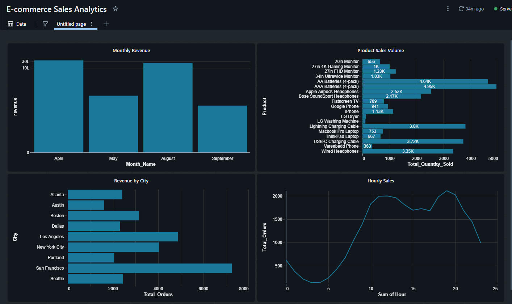
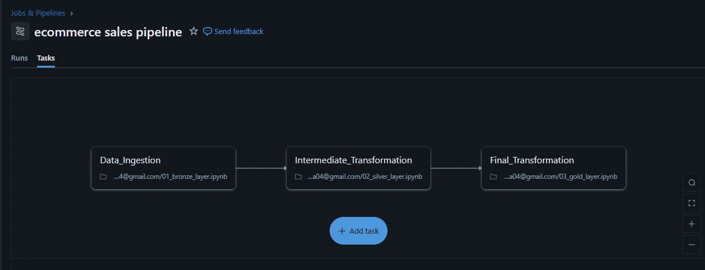
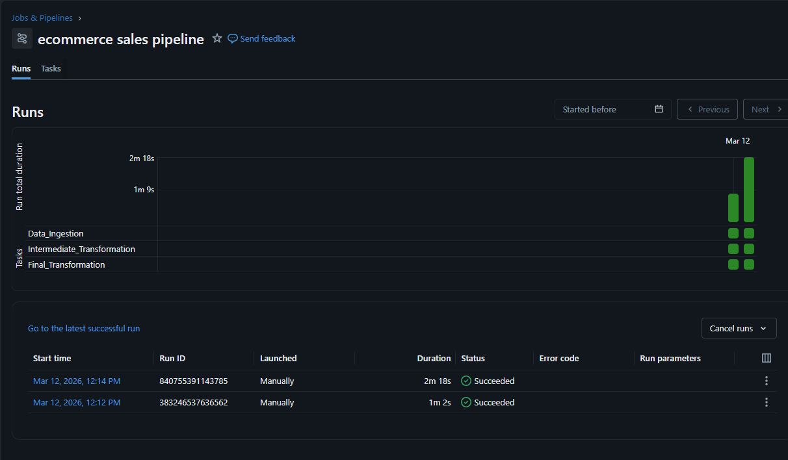

# 🛒 E-Commerce Sales Data Pipeline


An end-to-end ELT pipeline built on **Databricks Community Edition** using the **Medallion Architecture** (Bronze → Silver → Gold), processing 30,000+ e-commerce records with PySpark and Delta Lake, orchestrated via Databricks Jobs with automated email notifications.

---

## 📐 Architecture

```
Kaggle CSV
    ↓
[Bronze Layer]  →  Raw data ingestion → Delta Table
    ↓
[Silver Layer]  →  Cleaning & Transformation → Delta Table
    ↓
[Gold Layer]    →  Aggregations & KPIs → 4 Delta Tables
    ↓
[Dashboard]     →  4 Charts in Databricks SQL
```

---

## 🗂️ Project Structure

```
ecommerce-sales-pipeline/
├── notebooks/
│   ├── 01_bronze_layer.ipynb       ← Raw data ingestion
│   ├── 02_silver_layer.ipynb       ← Cleaning & transformation
│   └── 03_gold_layer.ipynb         ← Aggregations & gold tables
├── screenshots/
│   ├── dashboard.png               ← Databricks SQL Dashboard
│   ├── pipeline_tasks.png          ← Databricks Jobs task flow
│   └── pipeline_runs.png           ← Successful pipeline runs
└── README.md
```

---

## 📦 Dataset

- **Source:** [Kaggle — Sales Dataset of Ecommerce (Electronic Products)](https://www.kaggle.com/datasets/deepanshuverma0154/sales-dataset-of-ecommerce-electronic-products)
- **Size:** ~30,000 rows
- **Period:** April 2019 — September 2019
- **Columns:** Order ID, Product, Quantity Ordered, Price Each, Order Date, Purchase Address

---

## 🛠️ Tech Stack

| Tool | Purpose |
|------|---------|
| Databricks Community Edition | Cloud compute & notebooks |
| PySpark | Data transformation |
| Delta Lake | Storage layer (ACID transactions) |
| Databricks SQL | Dashboard & visualization |
| Databricks Jobs | Pipeline orchestration |
| Python | Scripting & logic |

---

## 🔄 Pipeline Layers

### 🥉 Bronze Layer — Raw Ingestion
- Loaded raw CSV from Databricks Volume
- Renamed columns (replaced spaces with underscores)
- Saved as Delta table: `bronze_sales`

### 🥈 Silver Layer — Cleaning & Transformation
- Dropped **148 null rows** on critical columns (Order_ID, Order_Date, Price_Each)
- Removed **48 true duplicate** rows (same Order_ID + same Product)
- Converted `Order_Date` from string → timestamp
- Extracted `Month`, `Hour` from Order_Date
- Extracted `City` from Purchase_Address
- Added `Revenue` column = Quantity_Ordered × Price_Each
- Saved as Delta table: `silver_sales`

### 🥇 Gold Layer — Aggregations
| Table | Description |
|-------|-------------|
| `gold_monthly_revenue` | Total revenue per month |
| `gold_product_sales` | Quantity sold & revenue per product |
| `gold_city_sales` | Total orders & revenue per city |
| `gold_hourly_sales` | Total orders per hour of day |

---

## 📊 Dashboard



### Key Insights:
- 📅 **April** was the highest revenue month (~$3.38M)
- 🔋 **AAA Batteries** were the most sold product (4,947 units)
- 🌉 **San Francisco** generated the most revenue ($1.35M)
- 🕛 **12pm** was the peak shopping hour (1,997 orders)

---

## ⚙️ Pipeline Orchestration

### Task Flow:


Built a **Databricks Job** with 3 dependent tasks running sequentially:

```
Data_Ingestion → Intermediate_Transformation → Final_Transformation
  (Bronze)              (Silver)                    (Gold)
```

### Successful Runs:


- ✅ Automated success & failure **email notifications**
- ✅ Full pipeline runs in ~2 minutes
- ✅ Tasks run sequentially with dependency enforcement

---

## 🚀 How to Run

1. Clone this repository
2. Upload notebooks to **Databricks Community Edition**
3. Download dataset from Kaggle and upload to Databricks Volume
4. Run notebooks in order:
   - `01_bronze_layer.ipynb`
   - `02_silver_layer.ipynb`
   - `03_gold_layer.ipynb`
5. Create Databricks SQL Dashboard using Gold tables

---

## 📈 Data Quality Summary

| Layer | Rows | Notes |
|-------|------|-------|
| Bronze | 30,394 | Raw data |
| Silver | 30,198 | 148 nulls + 48 duplicates removed |
| Gold | Aggregated | 4 summary tables |

---

## 👤 Author

**MinatoNamikaze25**
- GitHub: [@MinatoNamikaze25](https://github.com/MinatoNamikaze25)
